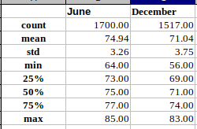

# Summary Statistics for June and December Temperature Data

## Purpose
The purpose of this analysis was to query a sqlite database and perform summary calculations on daily temperature data in order to understand the differences between different months of the year (specifically June vs. December).

## Results
The results can be compared easily with the following table:

* We had similar, and large (statistically credible) number of data points for June vs. December. This allows us to be more confident in comparing the other values.
* June has higher temperatures across the board (mean, min, all quartiles) than December, by approximately 2-8 degrees.
* June has lower variance in temperatures than December.

## Summary
Overall, June is warmer than December. It also has more consistent temperatures than December.

If we were to perform further analysis on the differences in weather between June and December, I would look at the following things:
1. Is there a difference in precipitation between June and December? This would mean doing the same query as in this analysis, but replacing the tobs column with the prcp column.
2. Is there a difference in temperature on days with / without precipitation between June and December? This would mean doing a query that groups by whether prcp > 0 and then doing an additional two summaries, one with precipitation and one without precipitation.
3. Are there differences between stations between June and December? This would mean doing a query that groups by station.
